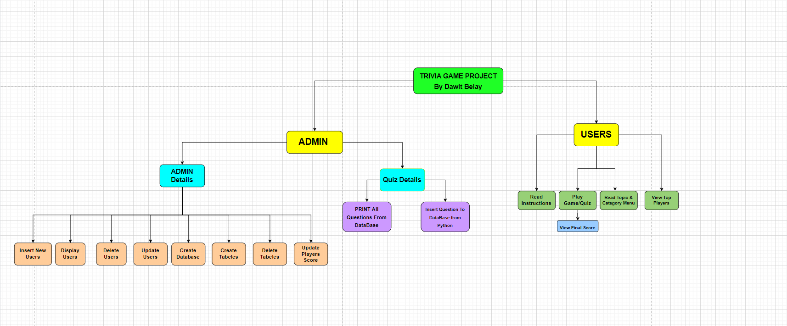
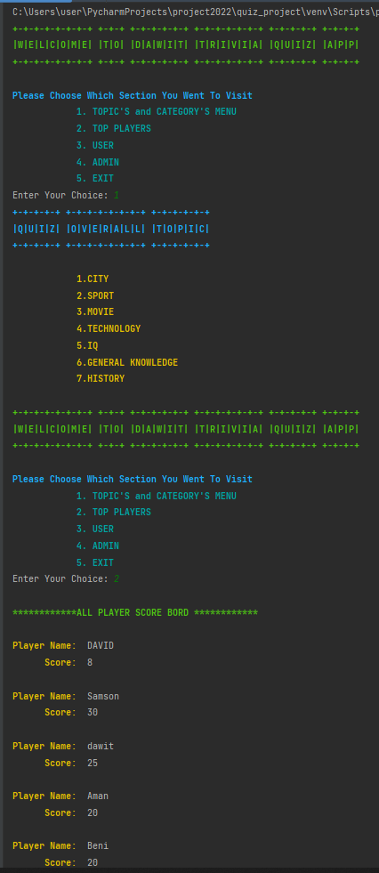
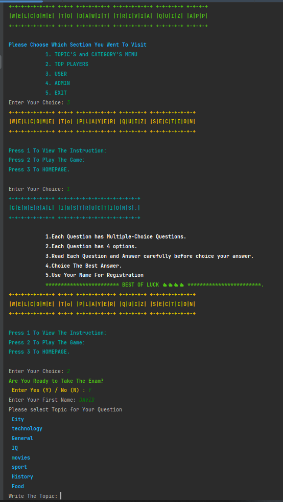
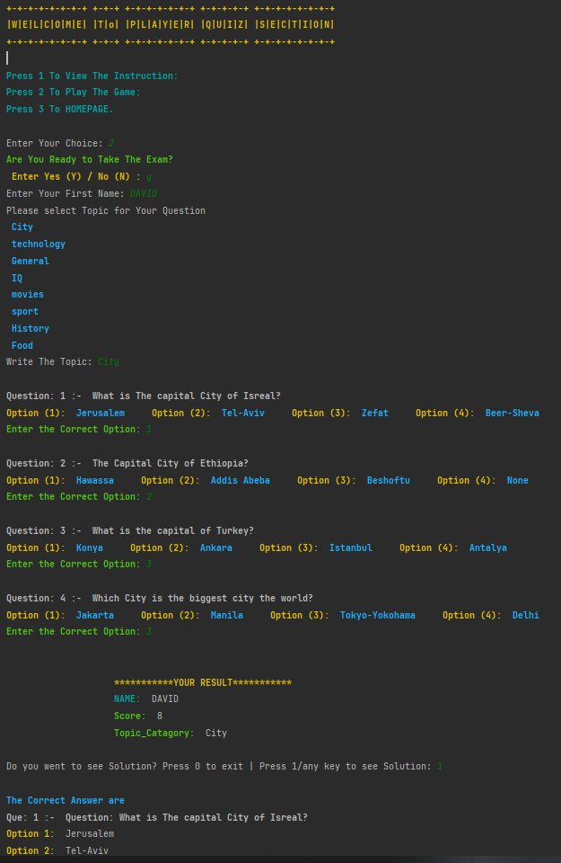
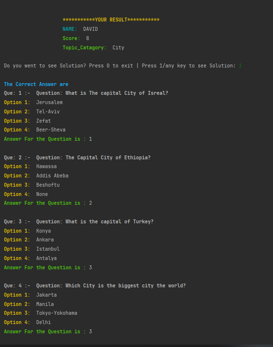
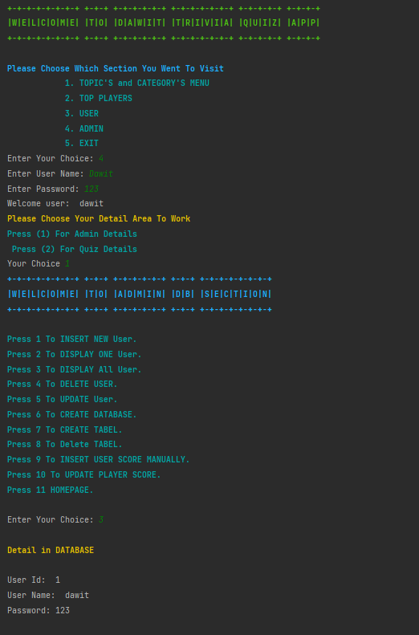
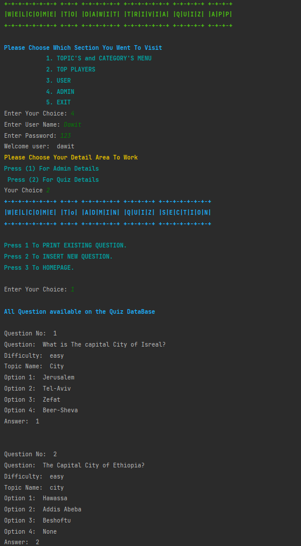
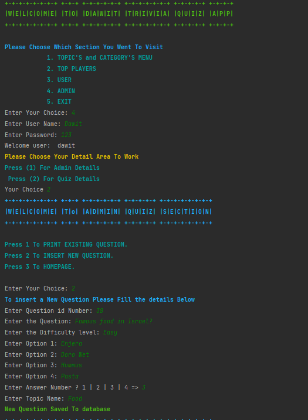
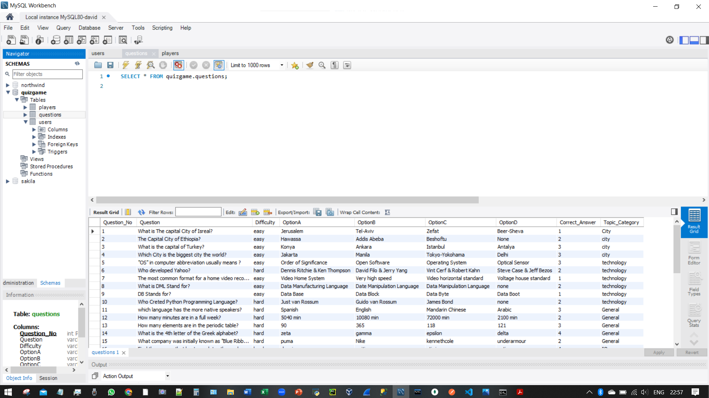

# ***.............................Trivia-Quiz-Game.......................***
    
## 👨‍💻Author 
- VERSION: 1.0.0
- Dawit Samson Belay
- [Link To GitHub/Dawit Belay](https://github.com/DavidBelay)

## **⚡ This Project is Trivia Question Game bullied in python and connected to Database **

# Overview
* The Project is Trivia Question Game, It bullied in python and connected to MYSQL database Server
* Trivia Game is a fun game in which players have to guess the answers of questions by filling the answers boxes with correct letters or choose.

### 🔑 Keywords:
>* mysql.connector = provide connectivity to the MySQL server for client programs.
>* pyfiglet = enhance the overall look and structure of the texts used in electronic communication way.
>* DesignColors = The color Library which I used
>* DataBase = Where the collection of data stored
>* Commit = used to make sure the changes made to the database
>* Execute = to execute Python MySQL queries on your MySQL database. 
>* queries = is a question or a request for information expressed in a formal manner. 
>* DML = Data Manipulation Language refers to DELETE, INSERT, REPLACE, SELECT, and UPDATE
>* MYDB = it refers to the database connection which I used

## **🖨️ How does This Trivia Question Game Works **
* First this question will have Admin User and Normal User.
* The admin users can access all the Database and the Users. 
* The admin can Create,Insert,Delete and Upgrade Users,players,Questions generality Admin will control this App.
* The Normal users only access for View instructions and start taking the quiz.
* Each Question has Multiple-Choice Questions.
* Each Question has 4 options.
* The User need to Read Each Question and Answer carefully before choice your answer.
* The Users need to Use There Name For Registration
* Once the User finish it will show to the user the Score in each Question

## 📈 Diagram 
* The General Flow chart Diagram for the Overall project

## 📸 Screenshot 

## ⚙ Usage
* Open Pycharm
* Open Mysql workbench
* Open the Pycharm .py File on Pycharm Community Edition 
* Run the pycharm .py file

# 🛠️ Project Tools and Packages Used
>On this Project I used
>- Python Loops 
>- Python Functions
>- Python Arrays
>- Python Conditions
>- Object-oriented programming (OOP)
>- Python Package (emoji, colorama)
>- PyCharm
>- pyfiglet
>- Mysql DataBase
>- Mysql.Connector-Python

# 💻 Source
- Pycharm software
- GitHub 
- Google
- Mysql DataBase 
- Mysql Workbench
- W3schools

### 🙌☺️️☺️🙌  Thank you!!!    🙌☺️️☺️🙌
